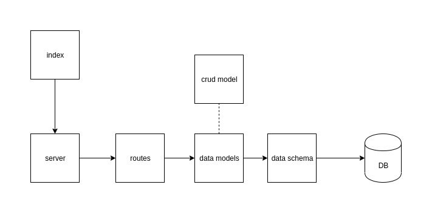

# LAB - 401-lab-10

## Final API Server

### Author: Travis Skyles

### Links and Resources
* [submission PR]()
* [travis]()
* [back-end]()
* [mongo-model npm](https://www.npmjs.com/package/@tskyles/mongo-model)

#### Documentation
* [api docs]()
* [jsdocs]()

### Setup
* clone repo
* npm init -y
* npm install

#### `.env` requirements
* `PORT` - Port Number
* `MONGODB_URI` - URL to the running mongo instance/db

#### How to initialize/run your server app (where applicable)
* Start App: `npm start`
* Endpoint: /api-docs
  * Returns api-documentation
* Endpoint: /docs
  * Returns JSdocs
* Endpoint: /api/v1/products
  * Returns all products
* Endpoint: /api/v1/products/:id
  * Returns specific products
* Endpoint: /api/v1/categories
  * Returns all categories
* Endpoint: /api/v1/categories/:id
  * Returns specific category
  
#### Tests
* Unit Tests: `npm test`
* Eslint: `npm run lint`

#### UML
